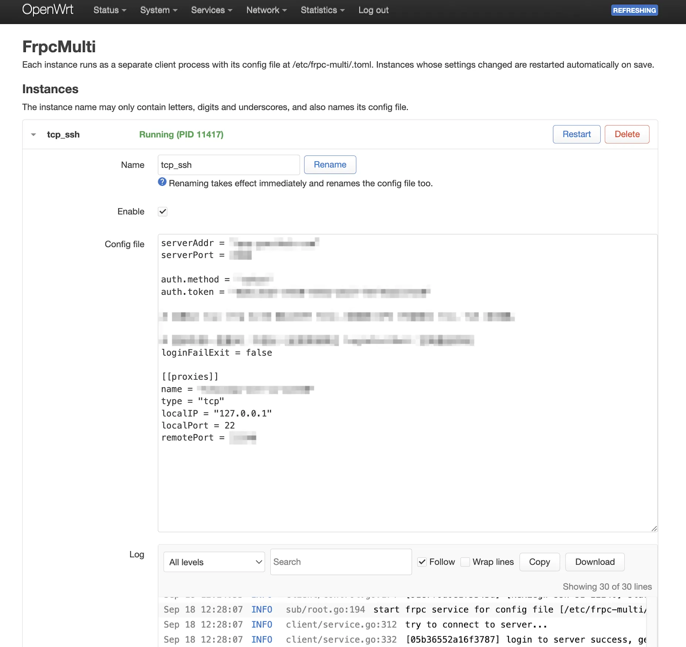

# frpc-multi

[English](README.md) | 简体中文

> [frp](https://github.com/fatedier/frp) 客户端的 OpenWrt 包，**一个服务跑多个 frpc 实例**，附带精简的 LuCI 界面。



每个实例是一个独立的 frpc 进程，使用自己的 TOML 配置文件，可以单独启停、重启、改名、看日志。
frpc 二进制直接取自 frp 官方 release，不自己编译。

包名、服务名、配置路径都用 `frpc-multi`，与官方软件源的 `frpc` / `luci-app-frpc` 互不冲突，可以同时安装。

## 为什么需要它

- 官方 `frpc` 包只有一份配置，想连多个 frps、或者把不同隧道分开管理(一条挂了不影响另一条)就不方便。
- 官方 LuCI 把 frpc 的参数逐项做成表单，跟不上 frp 的新参数；这里直接编辑原生 TOML，frp 支持什么就能写什么。

## 组成

| 包 | 内容 |
|----|------|
| `frpc-multi` | `/usr/libexec/frpc-multi/frpc`(官方二进制) + procd 多实例服务 `/etc/init.d/frpc-multi` + UCI 配置 + 改名脚本 |
| `luci-app-frpc-multi` | LuCI 界面(服务 → FrpcMulti)，英文界面 + 简体中文翻译 |

```
pkg/frpc-multi/           服务包(CONTROL + data 安装树)
pkg/luci-app-frpc-multi/  LuCI 包
po/zh_Hans/               LuCI 中文翻译
build.sh                  下载 frp release + 编译翻译 + 打包两个 .ipk(无需 OpenWrt SDK)
```

## 构建

依赖 curl、tar；没有 `po2lmo` 时会自动拉 [openwrt-dev/po2lmo](https://github.com/openwrt-dev/po2lmo) 编一份(需要 cc/make)。

```sh
./build.sh                                   # x86_64
ARCH=aarch64_cortex-a53 ./build.sh
ARCH=arm_cortex-a7_neon-vfpv4 ./build.sh     # 带硬浮点的 arm 用 frp 的 arm_hf 版
ARCH=mipsel_24kc UPX=1 ./build.sh            # 小闪存机型可 upx 压缩(frpc 约 16MB)
FRP_VERSION=0.71.0 ./build.sh                # 指定 frp 版本(默认 0.71.0)
VERSION=1.2.0 ./build.sh                     # 两个 .ipk 的版本号, CI 用 tag 设置
```

`ARCH` 会自动映射到 frp release 的架构名，认不出时用 `FRP_ARCH=` 手动指定。
产物在 `out/`，下载的 release 缓存在 `dl/`。

## 安装与配置

```sh
opkg install frpc-multi_*_<arch>.ipk luci-app-frpc-multi_*_all.ipk
```

装完带一个停用的示例实例 `main`。在 LuCI 里填好配置后打开，或者直接改文件：
每个 `instance` 段是一个实例，配置文件固定为 `/etc/frpc-multi/<实例名>.toml`。

```
# /etc/config/frpc-multi
config instance 'office'
	option enabled '1'
config instance 'home'
	option enabled '1'
```

```sh
/etc/init.d/frpc-multi reload                   # 只重启配置文件或开关有变化的实例
/etc/init.d/frpc-multi restart office           # 只重启一个实例
/usr/libexec/frpc-multi/rename office work      # 改名, 配置文件一起改
logread -e '^frpc-office\['                     # 单个实例的日志
```

实例名只能用字母、数字和下划线。配置文件缺失或为空的实例会被跳过，并在它的日志里留一条警告。

## LuCI

- 每个实例折叠成一行，显示运行状态，可单独重启、删除；展开后可改名、开关、编辑配置文件、查看日志。
- 保存时直接写配置文件并 reload，只有改动过的实例会重启。
- 改名立即生效；有未“保存并应用”的改动时会拒绝，免得那些改动还指着旧名字。
- 日志面板可按级别筛选、搜索、跟随最新、换行、复制、下载，最多显示最近 500 行。
- 删除实例不会删除它的 `.toml`，同名重建会沿用。
- 界面默认英文；LuCI 语言为中文，或为“自动”且浏览器是中文时显示中文。

## 行为说明

- 每个实例经 `/var/run/frpc-multi/frpc-<实例名>` 软链接启动，系统日志标签因此是 `frpc-<实例名>[pid]`，日志可以按实例区分。
- 进程由 procd 托管，退出后自动拉起。frp 默认登录失败就退出，想让它一直重试可在配置里加 `loginFailExit = false`。
- frpc 默认输出带颜色的日志，建议在配置里加 `log.disablePrintColor = true`；不加也行，LuCI 会把颜色码去掉。

## 翻译

界面源码里写英文并用 `_()` 包起来，中文加到 `po/zh_Hans/frpc-multi.po`。
构建时编成 `/usr/lib/lua/luci/i18n/frpc-multi.zh-cn.lmo` 打进 LuCI 包。
